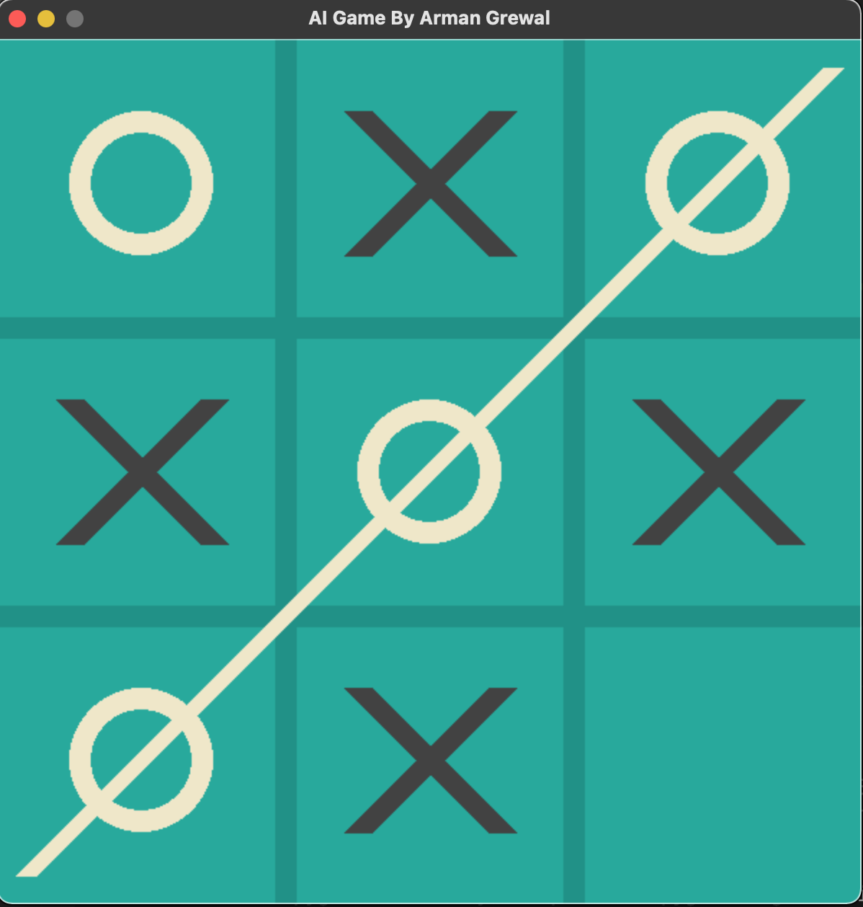

# Tic Tac Toe Game With AI

This is a simple tic tac toe game that can be played with two players, or AI. The AI comes with two modes, 0 or 1. AI level 0 is random AI and level 1 is the unbeatable AI. The unbeatable AI will never loose only win or tie. This program implements the minimax algorithm with alph beta pruning to make the algorithm more efficient. 

## Table of Contents

- [Installation](#installation)
- [Usage](#usage)
- [Configuration](#configuration)
- [Features](#features)
- [Contributing](#contributing)
- [License](#license)
- [Acknowledgments](#acknowledgments)
- [Contact](#contact)

## Installation

Provide instructions on how to install and set up your project. Include any dependencies, requirements, or environment setup.

## Usage

Explain how to use your project. Provide code examples, usage scenarios, or any relevant information to help users understand its purpose.

## Configuration

If your project requires configuration, API keys, or settings adjustments, explain how users can set up these configurations.

## Features

List the main features and functionalities of your project. Be concise and clear.

## Contributing

Explain how others can contribute to your project. Provide guidelines for bug reports, feature requests, and pull requests. Include a code of conduct if applicable.

## License

Specify the license under which your project is released. Include information about how others can use and distribute your code.

## Acknowledgments

Give credit to any external libraries, tools, or resources you used in your project. Acknowledge contributors or sources of inspiration.

## Contact

Provide a way for users to contact you or reach out for support. This could be your GitHub profile, email address, or other contact information.
